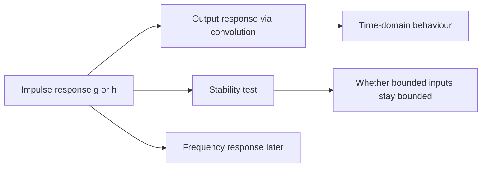

## Rough picture: response and stability are linked views

Your suspicion is right: **response** and **stability** are not really separate worlds. They are two ways of asking about the same system.

For a linear time-invariant system, the impulse response — lecturer/lab notation $g$, Atlas notation likely $h$ — is the central object.

Continuous time:

$$
y(t) = (x * g)(t) = \int_{-\infty}^{\infty} x(\tau)g(t-\tau)\,d\tau
$$

Discrete time:

$$
y[n] = (x * g)[n] = \sum_{k=-\infty}^{\infty} x[k]g[n-k]
$$

So:

- **Response** asks: given an input $x$, what output $y$ does the system produce?
- **Stability** asks: can the system’s response stay controlled for every bounded input?

For LTI systems, BIBO stability is decided by the impulse response:

Continuous time:

$$
\int_{-\infty}^{\infty} |g(t)|\,dt < \infty
$$

Discrete time:

$$
\sum_{n=-\infty}^{\infty} |g[n]| < \infty
$$

So stability is not a detached topic. It is a property of the response kernel $g$ / $h$.

## Notation translation

A safe working dictionary is:

| Lecturer / labs | Atlas |
|---|---|
| $g(t)$ or $g[n]$ | $h(t)$ or $h[n]$ |
| impulse response | impulse response |
| output response | convolution with impulse response |

So if Atlas says:

$$
y(t) = x(t) * h(t)
$$

you can usually read the lecturer’s version as:

$$
y(t) = x(t) * g(t)
$$

Same idea, different letter.

## How the resources seem to fit

Based on `course-overview.md`:

- **Lumen lecture notes**: probably the lecturer’s conceptual organisation: response → stability → frequency.
- **Lab sheets**: likely closer to lecturer assumptions and notation, especially since they explicitly use $g(t)$ or $g[n]$.
- **Atlas**: better for derivations, but may use different notation such as $h$.

One caution: the available lab material is mixed — one sheet says continuous-time $g(t)$, another notice says discrete-time $g[n]$. So for any particular lab question, first check whether it is in continuous time or discrete time before copying formulas.

## Mental map

The compact version:

> The impulse response tells you both how the system responds and whether that response is well-behaved enough to be stable.

So for now, I’d treat “response” as the main object and “stability” as one important question you ask about that object.
