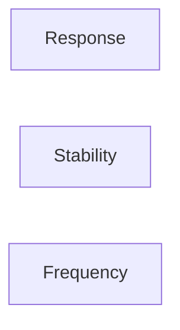
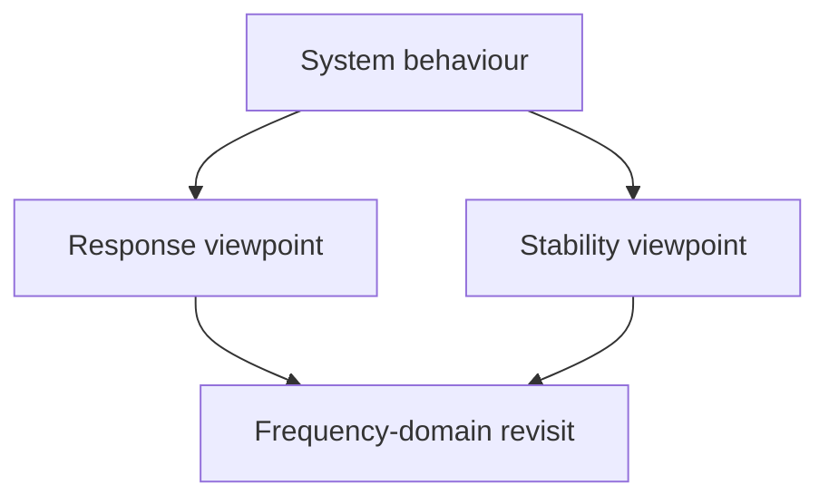

## Updated orientation

That changes the course picture like this:

- **Response**: asks what the system does to an input, often through impulse response, convolution, step response, etc.
- **Stability**: asks whether those responses stay bounded or decay/accumulate in a controlled way.
- **Frequency**: is not a separate third pillar; it revisits response and stability through frequency-domain tools.

So instead of treating the course as three independent modules,

it is better to picture it as:

The source convention also changes:

- Use **Lumen** for current course conventions.
- Treat the current lab as **discrete-time**, so expect notation like $g[n]$.
- Use **Atlas** mainly for derivations, translating notation where needed, e.g. Atlas $h$ may correspond to course/lab $g$.
- Older continuous-time sheets with $g(t)$ should not guide the current lab setup.

And yes: I’ve recorded this as an orientation correction only, not as evidence that you’ve learned the mathematics. The orientation activity is now complete.
