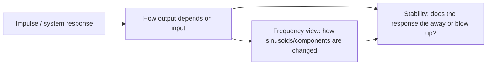

## Choosing between the resources

Use them by role, not as competitors:

- **Lumen / lecturer notes**: your main path through the course. Use this for what to prioritise, notation, and the intended framing.
- **Atlas textbook**: use when Lumen is too compressed and you want a fuller derivation or another explanation.
- **Lab sheets**: use for practice and implementation details, but treat them as local to a lab unless their date/version is clear.

So before the next lab: start from **Lumen’s relevant section**, then use **Atlas only to fill derivational gaps**, then apply that to the **lab sheet tasks**.

## Connecting response, stability and frequency

A useful mental link is:

Response is the basic object: “what does the system do?”  
Stability asks whether that response remains controlled.  
Frequency material re-expresses the same system behaviour by asking how different frequency components are amplified, attenuated, or phase-shifted.

So frequency is not a totally separate island; it revisits response and stability through a frequency-domain lens.

## Symbol difference we noticed

The notation difference was:

- **lecturer / Lumen convention**: impulse response written as something like `$g$`
- **Atlas textbook convention**: may use `$h$` for the impulse response

So if Atlas says `$h(t)$` or `$h[n]$`, that may correspond to the lecturer’s `$g(t)$` or `$g[n]$`, depending on the time convention.

## The lab time-convention conflict

The two files genuinely disagree:

- `lab-notice.md`: discrete-time signals, impulse response `$g[n]$`
- `current-lab-sheet.md`: continuous-time signals, impulse response `$g(t)$`

Both also say they have **no issue date or edition identifier**. From just these files, we **cannot settle which one is authoritative**. The safest provisional conclusion is:

> There is an unresolved materials conflict: one source says discrete time, the other says continuous time.

For practical lab prep, I would not infer the answer. I’d carry both translations:

- continuous time: `$g(t)$`, integrals, continuous signals
- discrete time: `$g[n]$`, sums, sequences

Then check the lecturer/VLE/lab demonstrator for which convention governs the actual next lab.
